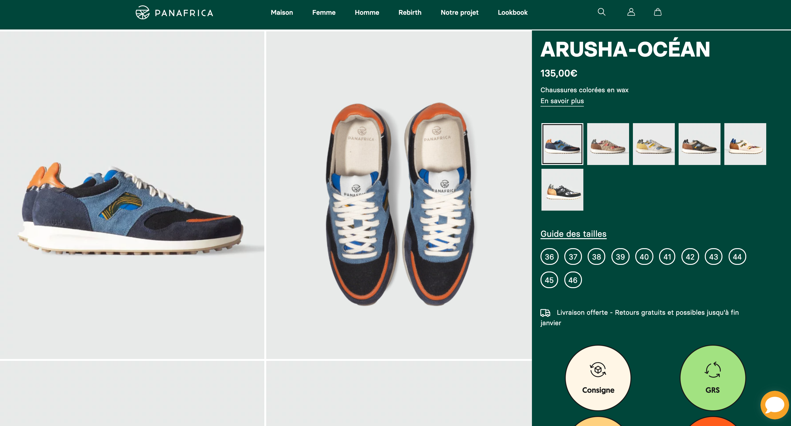
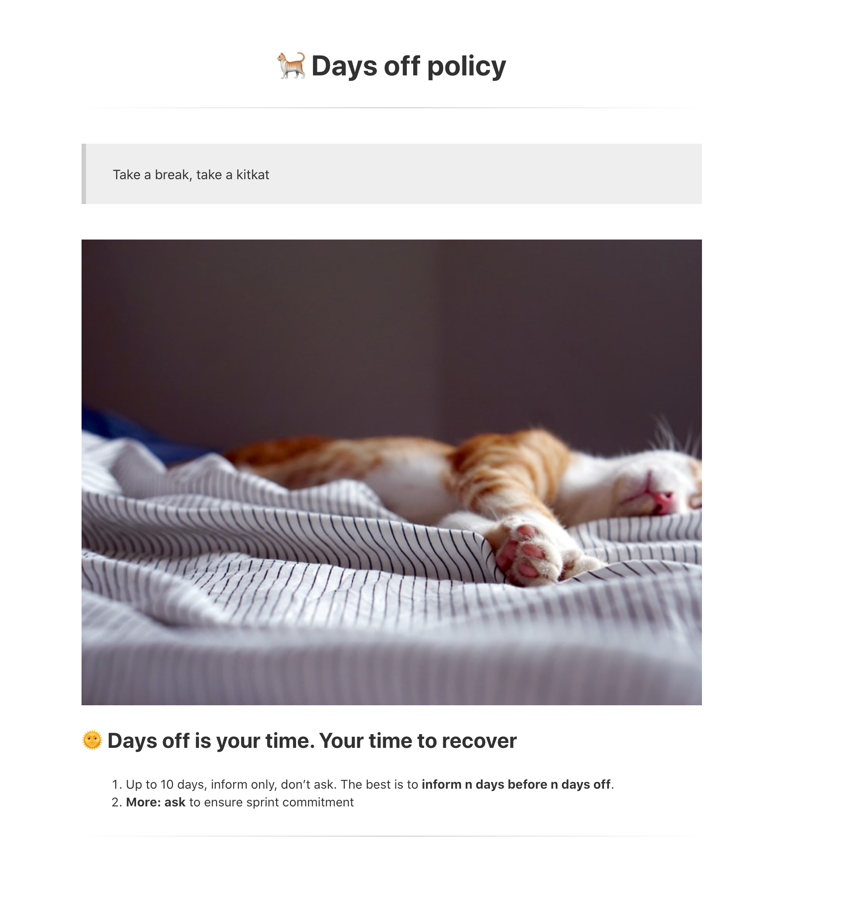
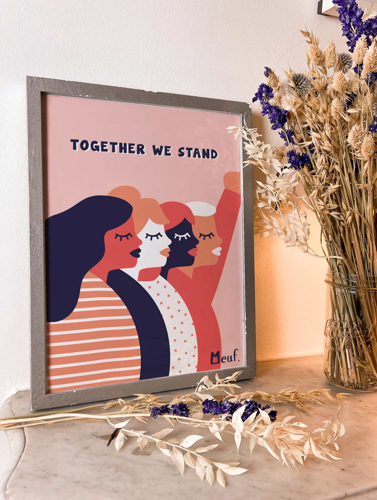
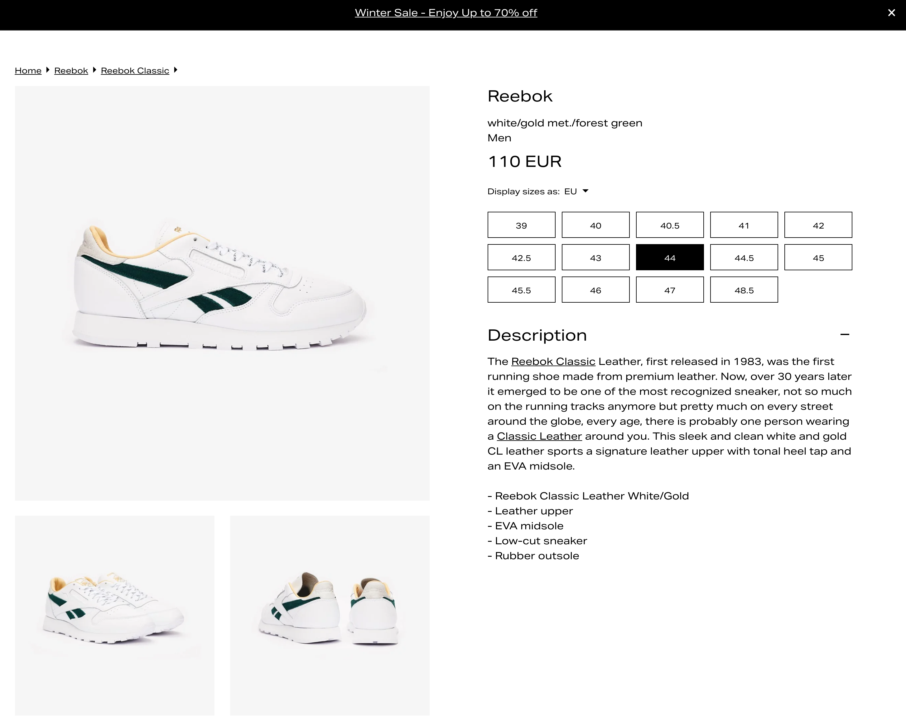
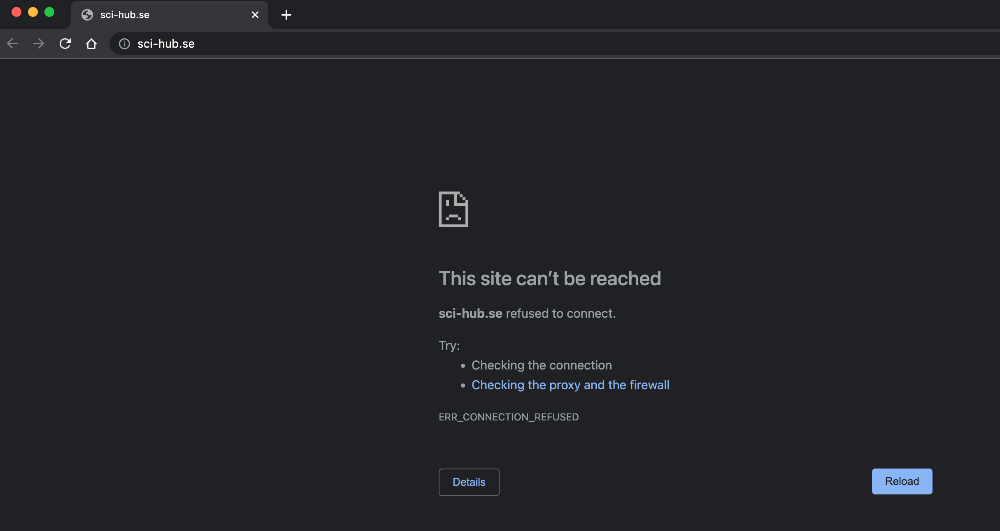
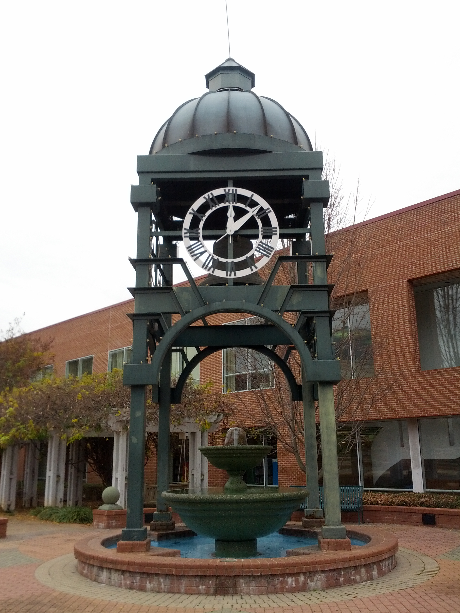
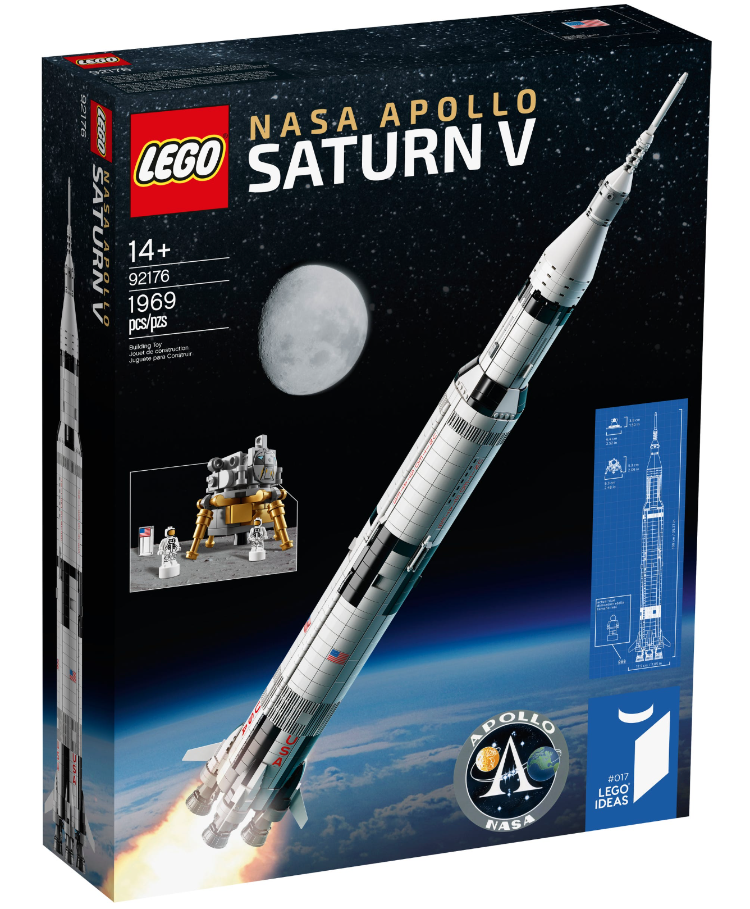

# The Ten Challenge

> 10 (in fact over 10) Questions to challenge your non-programming skills


<!-- START doctoc generated TOC please keep comment here to allow auto update -->
<!-- DON'T EDIT THIS SECTION, INSTEAD RE-RUN doctoc TO UPDATE -->
**Table of Contents**

- [🐣 Introduction](#-introduction)
- [👩🏽‍💻 Challenges](#%E2%80%8D-challenges)
  - [🥾 Challenge 0 - Notion.so](#%F0%9F%A5%BE-challenge-0---notionso)
  - [🥾 Challenge 1 - Panafrica](#%F0%9F%A5%BE-challenge-1---panafrica)
  - [📱 Challenge 2 - Wow](#-challenge-2---wow)
  - [🎤 Challenge 3 - Tagline](#-challenge-3---tagline)
  - [🖱 Challenge 4 - Right-click](#%F0%9F%96%B1-challenge-4---right-click)
  - [🌄 Challenge 5 - Origin](#-challenge-5---origin)
  - [💳 Challenge 6 - E-shop](#-challenge-6---e-shop)
  - [📝 Challenge 7 - Code review](#-challenge-7---code-review)
  - [👾 Challenge 8 - Sci hub](#-challenge-8---sci-hub)
  - [📺 Challenge 9 - Bash](#-challenge-9---bash)
  - [📍 Challenge 10 - Where is it?](#-challenge-10---where-is-it)
  - [🚀 Challenge 11 - Saturn V](#-challenge-11---saturn-v)
  - [🏘 Challenge 12 - Run this town](#%F0%9F%8F%98-challenge-12---run-this-town)
  - [⁉️ Last challenge - White screen](#-last-challenge---white-screen)

<!-- END doctoc generated TOC please keep comment here to allow auto update -->

## 🐣 Introduction

Being a programmer is all about **non-programming skills** as empathy, communication, patience and adaptability.

These 10 following questions will challenge your

1. **Problem Solving** -  How do you break a problem into smaller ones.
2. **Creativity** - How do you optimize solution with creativity.
3. **Value of effort** - How do you persevere to find the solution.

## 👩🏽‍💻 Challenges

For each challenge, follow the steps instruction and **share your solution or your  suggestion**.

### 🥾 Challenge 0 - Notion.so

Create a free accout on [Notion.so](https://www.notion.so/), a note-taking web application.
Create a page called `Ten Challenges`

### 🥾 Challenge 1 - Panafrica

Open the link [https://panafrica-store.com/produit/panafrica-arusha-ocean-chaussures-colorees-wax-suede-responsables-consignee-ethique-2/](https://panafrica-store.com/produit/panafrica-arusha-ocean-chaussures-colorees-wax-suede-responsables-consignee-ethique-2/) in your browser and **take a screenshot of the ARUSHA-OCÉAN model complete page**.



### 📱 Challenge 2 - Wow

Give me **a link and a screenshot of a website that has surprised you in terms of User Experience** (avoid Facebook, Snapchat etc...).

An impressive User Experience is new, unusual, clear and easy to use.

### 🎤 Challenge 3 - Tagline

**Write a (english) Tagline (catchline) to tell us about your 2022 year**.

A tagline should be:

* Short
* Simple
* Clear
* Direct
* Memorable
* Catch
* Irresistible
* Positive
* Melodious

### 🖱 Challenge 4 - Right-click

Write the **size (MB on disk) and dimension (pixel)** of the cat image from the link [https://esilv-off.vercel.app](https://esilv-off.vercel.app/) 👇



### 🌄 Challenge 5 - Origin

Give me the **original url** from which this image was downloaded 👇🏽



### 💳 Challenge 6 - E-shop

**What's wrong** with this product page 👇🏽



### 📝 Challenge 7 - Code review

Give me **3 potential issues with this Golang source code**:

```go
package calculator

import "logger"

func Add(a, b int) int {
	return a + b


}

func multiple(a, b int) 	int {
	l, _ := logger.NewLogger("/tmp/test1")

	l.UnusedExt = "test7"

	return a * b
}

func Divide(a, b int) int {
	return a / b
}
```

### 👾 Challenge 8 - Sci hub

Take a homepage screenshot of this website [https://sci-hub.se/](https://sci-hub.se/)

And no. The correct screenshot is not this following one ⤵️



### 📺 Challenge 9 - Bash

Write a bash script to open your default browser with 2 tabs:
1. The first tab with the following address: [https://github.com/92bondstreet/javascript-empire](https://github.com/92bondstreet/javascript-empire)
2. The second tab with the following address: [https://www.google.fr](https://www.google.fr)

```bash
#!/bin/bash

function open() {
    # I open my navigator with 2 tabs
    # ...
}

open
echo "Exit code: $?"
```

### 📍 Challenge 10 - Where is it?

Where was this picture taken?



### 🚀 Challenge 11 - Saturn V

Where can I buy the cheapest of this - out of stock - lego model: [Saturn V - 92176](https://www.lego.com/fr-fr/product/lego-nasa-apollo-saturn-v-92176)




### 🔐 Challenge 12 - Decode

```
Alk'q yb xcoxfa ql cxfi yfd, ql aobxj yfd, yrq objbjybo aobxjp tfqelrq dlxip xob grpq aobxjp xka qebv riqfjxqbiv crbi afpxmmlfkqjbkq. Pl exsb aobxjp, yrq exsb dlxip. Ifcb dlxip, vbxoiv dlxip, jlkqeiv dlxip, axfiv dlxip. F qov ql dfsb jvpbic x dlxi bsbovaxv.
Abkwbi Texpefkdqlk
```

### 🏘 Challenge 13 - Run this town

Give me **the 5 cities of the Yvelines (78) which have [the most best High School (lycées)](https://www.letudiant.fr/palmares/classement-lycees/academie-versailles.html)**.

### ⁉️ Last challenge - White screen

Open the link [https://esilv-white-screen.vercel.app](https://esilv-white-screen.vercel.app/) and **follow the instructions**.
