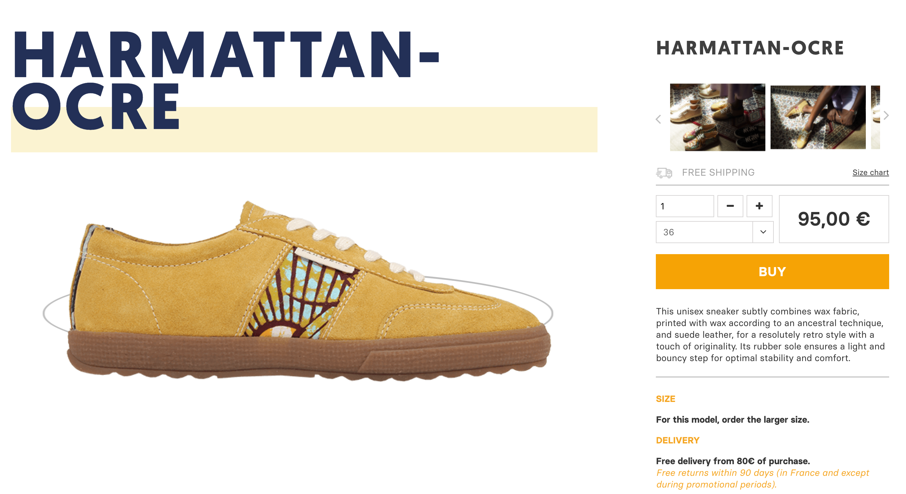

# The Ten Challenge

> 10 Questions to challenge your non-programming skills


## 🐣 Introduction

Being a programmer is all about **non-programming skills** as empathy, communication, patience and adaptability.

These 10 following questions will challenge your

1. **Problem Solving** -  How do you break a problem into smaller ones.
2. **Creativity** - How do you optimize solution with creativity.
3. **Value of effort** - How do you persevere to find the solution.

## 👩🏽‍💻 Challenges

For each challenge, follow the steps instrucation and **paste the solution or suggestion to your miro space**.

### 🥾 Challenge 1 - Panafrica

Open the link [https://www.panafrica-store.com/en/e-shop/317-panafrica-harmattan-ocre-unisex-sneaker-ethical-fashion.html](https://www.panafrica-store.com/en/e-shop/317-panafrica-harmattan-ocre-unisex-sneaker-ethical-fashion.htm) in your browser and **take a screenshot of the harmattan-ocre model complete page**.




### 📱 Challenge 2 - Wow

Give me **a link and a screenshot of a website that has surprised you in terms of User Experience** (avoid Facebook, Snapchat etc...).

An impressive User Experience is new, unusual, clear and easy to use.

### 🎸 Challenge 3 - Verse

Paste a **verse of Song Music that made an impression on you** (1 verse not just a punchline).

As Rodney "[Darkchild](https://www.instagram.com/rodneyjerkins/)" Jerkins (a famous songwriter) [said](https://www.redbull.com/int-en/jetta-and-darkchild-explain-how-to-write-a-pop-banger):

> When you marry melody with the right lyric, the right concept, and that resonates with people all over the world, to me that equates to a hit record.

### 🎤 Challenge 4 - Tagline

**Write a (english) Tagline (catchline) to tell us about your 2020 year**.

A tagline should be:

* Short
* Simple
* Clear
* Direct
* Memorable
* Catch
* Irresistible
* Positive
* Melodious


### 🖱 Challenge 5 - Right-click

Write the **size (MB on disk) and dimension (pixel)** of the image from the link

### 🌄 Challenge 6 - Origin

Give me the **original url** from which this image was downloaded 👇🏽


### 💳 Challenge 7 - E-shop

**What's wrong** with this product page 👇🏽


### 📝 Challenge 8 - Code review

Give me **3 potential issues with this Golang source code**:


```go
package calculator

import "logger"

func Add(a, b int) int {
	return a + b


}

func multiple(a, b int) 	int {
	l, _ := logger.NewLogger("/tmp/test1")

	l.UnusedExt = "test7"

	return a * b
}

func Divide(a, b int) int {
	return a / b
}
```

### Challenge 9 - Run this town

Give me the 5 cities of the Yvelines (78) which have [the best High School (lycées)](https://www.letudiant.fr/palmares/classement-lycees/academie-versailles.html).

### ⁉️ Challenge 10 - Blanka

Open the link [https://esilv-slack.vercel.app](https://esilv-slack.vercel.app/) and **follow the instructions**.
